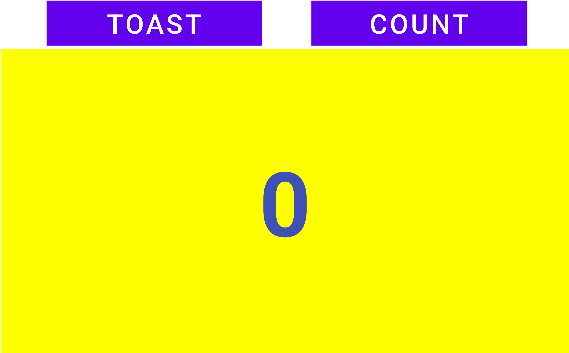

# lab work 2
## Hello Toast and Counter(Coding_Challenge)

**This is the second lab Exercise "The-Layout-Editor" and this readme file consist of the screenshot and video i.e. gif file for the final app created**

### Center the Button elements 

**Above screenshot show the button are center horizontally.The UI consists of 3 buttons and a
text view. The 'Toast' button displays a toast message and the 'Count' button increases the counter value in the text view.
Similarly, the 'Zero' button sets the counter value to 0 when pressed.**