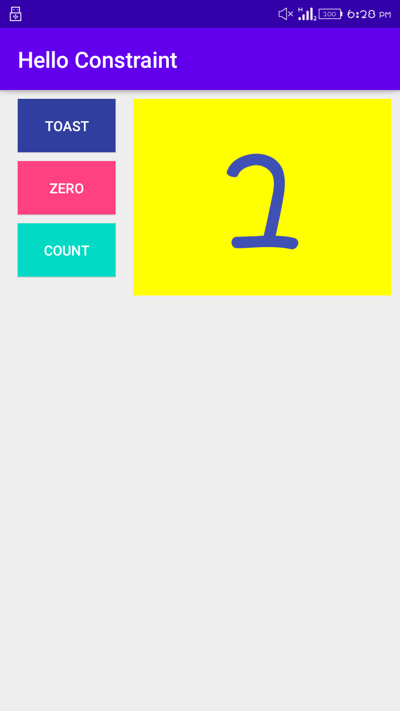
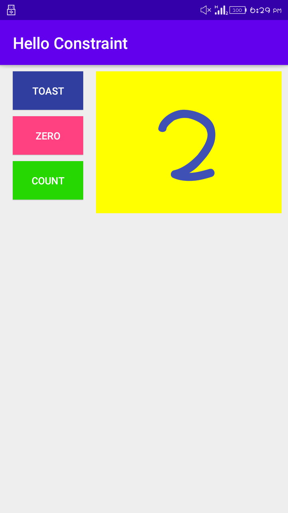
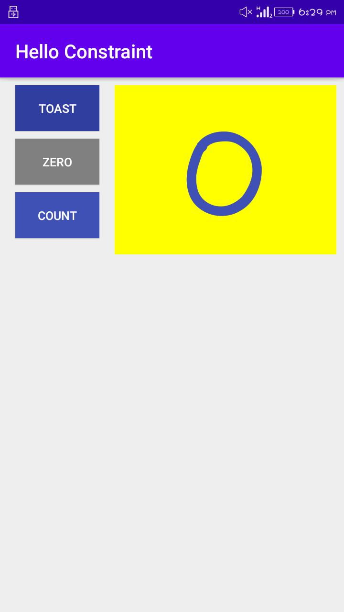
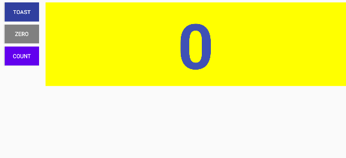
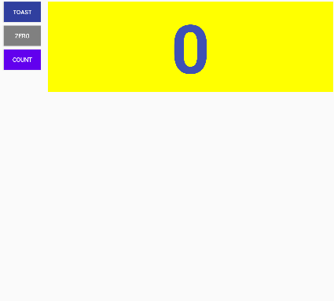

# lab work 2
## Hello Toast and Counter(Homework)

**This is the second lab Exercise "The-Layout-Editor" and this readme file consist of the screenshot and video i.e. gif file for the final app created**

### The UI

**The screenshot above shows the final UI of the app that was created in this exercise. The UI consists of 3 buttons and a
text view. The 'Toast' button displays a toast message and the 'Count' button increases the counter value in the text view.
Similarly, the 'Zero' button sets the counter value to 0 when pressed.**

---

### Count Button Feature

**This is the feature that is added to the count button where the background color of the button is set to light Green when
the counter value is 'even' and the color is set to light blue when the counter value is 'odd'.**

**The background color of the count button is set to light blue when the count value is odd.**

**The background color of the count button is set to light green when the count value is even.**

---

### Zero Button Feature

**This is the feature included with the zero button of the app. The background color of the button is set to teal when the
counter value is greater than 1 or when it is active and when it is pressed the value is set to 0 along with the change in its background color to what it
was before.**

**The background color of the zero button is set to teal referring that it is active.**

**The background color of the zero button is set to the original color when it is pressed. The count value is also set to 0.**

---

### UI in Land scape orientation

**The above screenshot show the land scape orientation**

---

### UI in tablet(Large devices)

**The above screenshot show the tablet view**

---

### Working process of App

**The above record gif file show the working functionality of the application.The UI consists of 3 buttons and a
text view. The 'Toast' button displays a toast message and the 'Count' button increases the counter value in the text view.
Similarly, the 'Zero' button sets the counter value to 0 when pressed.**
