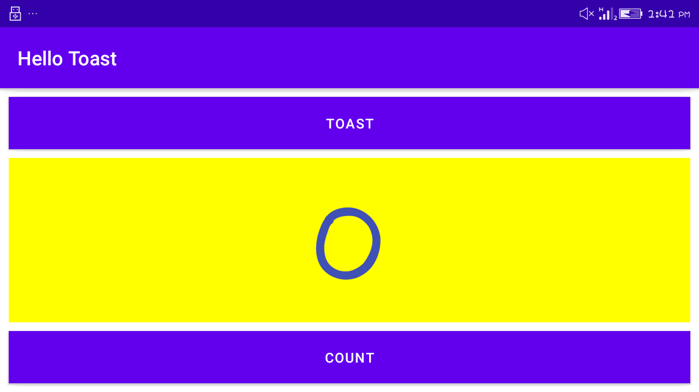

# lab work 2
## Hello Toast and Counter(Task_1)
**This is the second lab Exercise "The-Layout-Editor" and this readme file consist of the screenshot and video i.e. gif file for the final app created**

### layout in a horizontal orientation

**The above screenshot shows the horizontal orientation of app in mobile**

### layout for horizontal orientation(Land)
.png)

**The above screenshot shows the horizontal orientation in land of app in mobile**

### portrait orientation in tablet 
.png)

**The above screenshot shows the portrait orientation of app in tablet**

### LandScape orientation in tablet
.png)

**The above screenshot shows the landscape orientation of app in tablet**
