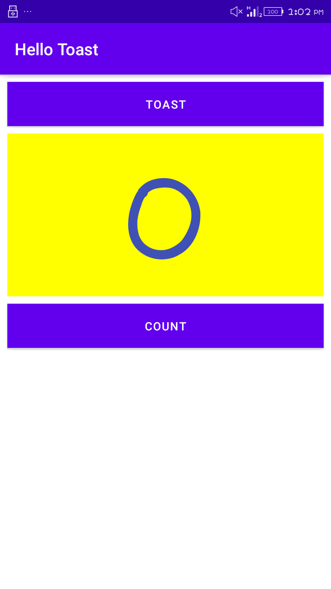

# lab work 2
## Hello Toast and Counter(Task_3)

**This is the second lab Exercise "The-Layout-Editor" and this readme file consist of the screenshot for the final app created**

### Change layout to Relative Layout

**the above screenshot show the relative layout of hello toast**