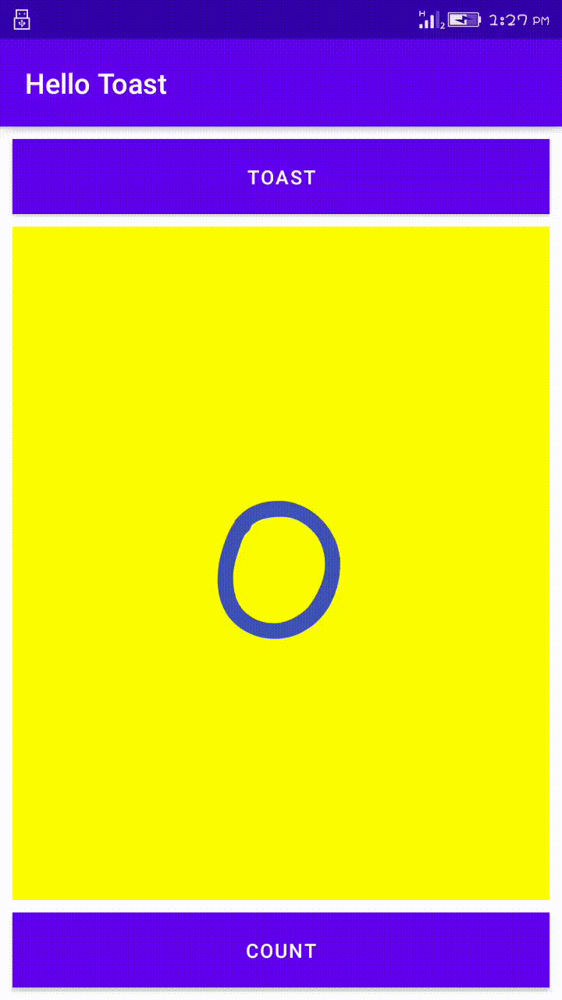

# lab work 2
## Hello Toast and Counter(Task_1)
**This is the second lab Exercise "The-Layout-Editor" and this readme file consist of the screenshot and video i.e. gif file for the final app created**

### layout in a horizontal orientation

**The above screenshot shows the horizontal orientation of app in mobile**

### layout for horizontal orientation(Land)
.png)

**The above screenshot shows the horizontal orientation in land of app in mobile**

### portrait orientation in tablet 
.png)

**The above screenshot shows the portrait orientation of app in tablet**

### LandScape orientation in tablet
.png)

**The above screenshot shows the landscape orientation of app in tablet**

## Record Of Application

**The video above shows the UI of the final app created for the task_1 section of lab 2. The UI 
consists of three different views; 2 button views and 1 text view. The 'Toast' button is used to 
display the toast message while the 'Count' button is used to increase the count value when pressed. 
Similarly, the text view at the center is used to display the current count value.lastly, for tablet
screenshot is provided.**
